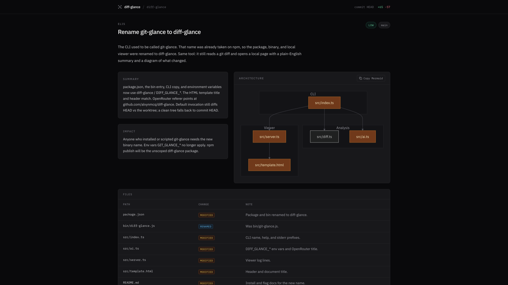

# diff-glance

[](https://www.npmjs.com/package/diff-glance)
[](LICENSE)

Turn messy git diffs into plain-English summaries and architecture diagrams.

```bash
npx diff-glance
```

```bash
npx diff-glance origin/main HEAD
```

Requires Node.js 18+, `git` on `PATH`, and an OpenAI-compatible API key (or a local Ollama endpoint). Default range is `HEAD` vs the worktree (staged + unstaged + untracked). If the worktree is clean, that falls back to `--commit HEAD`. The second command diffs two refs. There is no stdin pipe.

## What you get

```text
$ diff-glance
diff-glance: analyzing diff...
diff-glance: generating summary...
diff-glance: viewer at http://127.0.0.1:53102
diff-glance: press Ctrl+C to stop
```

The local viewer (bound to `127.0.0.1`) opens in your browser:

<p align="center">
  
</p>

Use `--json` to print the same analysis to stdout, or `-o report.html` to write the HTML file instead of serving it.

## Why it exists

- Line-by-line diffs do not answer “what changed and what might break.”
- A 30-second ELI5 plus a module graph is a usable mental model before a PR review.
- Lockfiles, binaries, and generated dirs are dropped before the model sees the patch.
- The viewer is an ephemeral local HTTP server. Nothing is uploaded except the truncated diff you send to the model you configured.

## Configuration

### Providers

| Provider | How it is selected | Default model |
| --- | --- | --- |
| OpenAI | `OPENAI_API_KEY` | `gpt-4o-mini` |
| Google Gemini | `GEMINI_API_KEY` or `GOOGLE_API_KEY` | `gemini-3.6-flash` |
| OpenRouter | `OPENROUTER_API_KEY` | `openai/gpt-4o-mini` |
| Groq | `GROQ_API_KEY` | `llama-3.3-70b-versatile` |
| Ollama | `--base-url http://127.0.0.1:11434/v1` | `llama3.2` |
| Custom | `--base-url` + `--api-key` | `gpt-4o-mini` unless the URL matches a row above |

Anthropic is not a native SDK path. Route it through OpenRouter (`--model anthropic/claude-sonnet-4`) or any other OpenAI-compatible gateway. Vertex AI works the same way: pass its OpenAI-compatible `--base-url`.

If more than one key is set, resolution order is: `--api-key` → `DIFF_GLANCE_API_KEY` → `OPENAI_API_KEY` → `OPENROUTER_API_KEY` → `GROQ_API_KEY` → `GEMINI_API_KEY` / `GOOGLE_API_KEY` / `GOOGLE_GENERATIVE_AI_API_KEY`. A dummy key of `ollama` is used only when the base URL is local and no other key is present.

### CLI

| Flag | Behavior |
| --- | --- |
| `[from]` `[to]` | Git refs. One arg diffs that ref vs the worktree; two args diffs `from..to`. |
| `-s, --staged` | Staged changes only (`git diff --cached`). |
| `-c, --commit <sha>` | That commit vs its parent (`<sha>^!`). |
| `-m, --model <id>` | Model id. |
| `--base-url <url>` | OpenAI-compatible API base URL. |
| `--api-key <key>` | API key. |
| `-p, --port <n>` | Viewer port. `0` (default) picks an ephemeral port. |
| `--host <host>` | Viewer bind host. Default `127.0.0.1`. |
| `--no-open` | Do not open a browser. |
| `--json` | Print analysis JSON to stdout; skip the viewer. |
| `--max-chars <n>` | Max diff characters sent to the model. Default `80000`. |
| `-o, --output <file>` | Write HTML to a file instead of serving. |

```bash
diff-glance --staged
diff-glance --commit HEAD
diff-glance --json
diff-glance -o glance.html --no-open
diff-glance --base-url http://127.0.0.1:11434/v1 --model llama3.2
```

### Environment

| Variable | Role |
| --- | --- |
| `OPENAI_API_KEY` | OpenAI key (also used as a generic key if you set a custom base URL). |
| `OPENAI_BASE_URL` | OpenAI-compatible base URL. |
| `OPENAI_MODEL` | Model id fallback. |
| `DIFF_GLANCE_API_KEY` | Overrides other keys except `--api-key`. |
| `DIFF_GLANCE_BASE_URL` | Overrides `OPENAI_BASE_URL`. |
| `DIFF_GLANCE_MODEL` | Overrides `OPENAI_MODEL`. |
| `OPENROUTER_API_KEY` | Selects OpenRouter. |
| `GROQ_API_KEY` | Selects Groq. |
| `GEMINI_API_KEY` / `GOOGLE_API_KEY` / `GOOGLE_GENERATIVE_AI_API_KEY` | Selects Gemini. |
| `DIFF_GLANCE_DEBUG` | If set, print the raw error after the one-line stderr message. |

`--base-url` and `--model` beat the env vars. There is no `AI_BASE_URL` or `AI_MODEL`.

## Local-first and privacy

The HTML viewer never leaves the machine. It listens on `127.0.0.1` and serves one generated page.

Cloud providers receive the truncated unified diff (lockfiles and binaries already stripped). Point `--base-url` at `http://127.0.0.1:11434/v1` (Ollama or any other local OpenAI-compatible server) and the request stays on localhost — no `--local` flag; the loopback URL is what keeps the payload off the network.

## Development

```bash
git clone https://github.com/alvynmcq/diff-glance.git
cd diff-glance
npm install
npm run dev
```

`npm run dev` runs `tsx src/index.ts`. `npm run build` emits `dist/` for `node bin/diff-glance.js`. `npm run typecheck` runs `tsc --noEmit`.

## License

[MIT](LICENSE)
